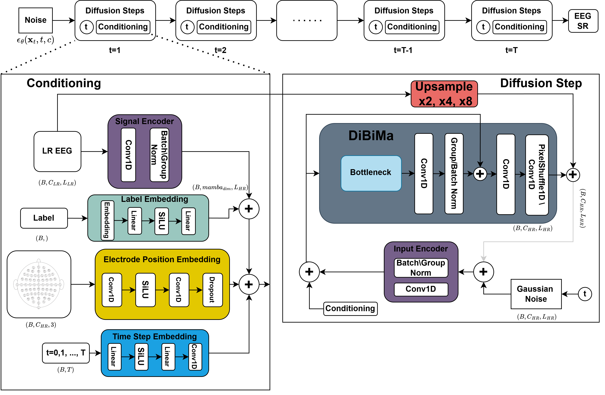
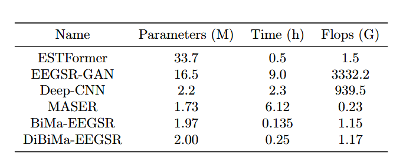
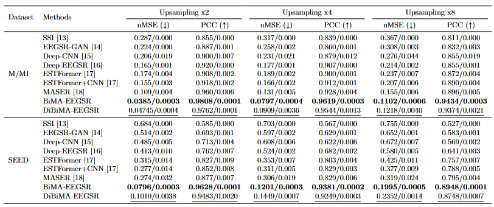
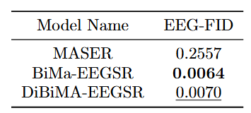
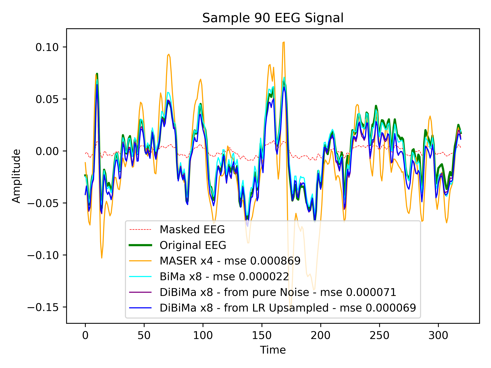
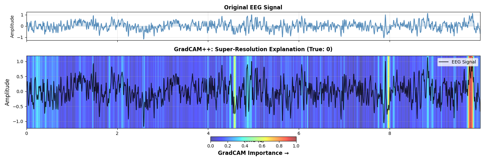
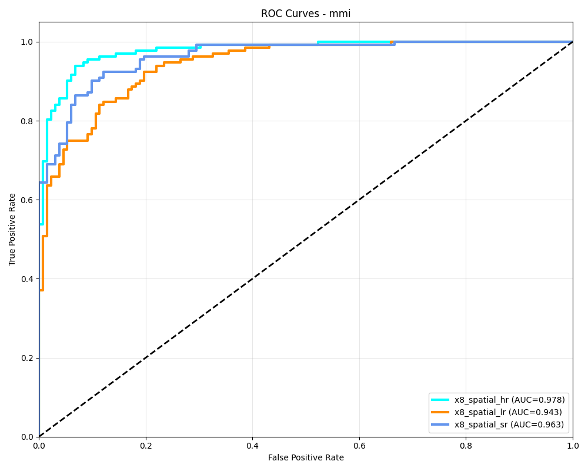
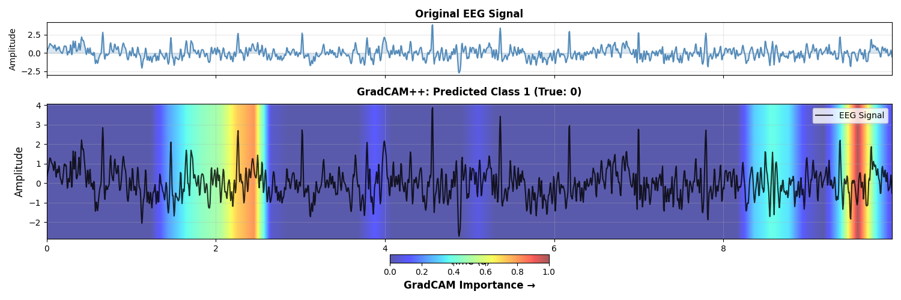

# DiBiMa-EEGSR

Code for the reproduction of results obtained in "Bidirectional Mamba Boosts EEG Super-Resolution via Regression and Diffusion"

## You can explore a live demo of the tool on Hugging Face Spaces: 

    https://huggingface.co/spaces/Ugo96/DiBiMa-EEGSR-Demo

## 🛠️ Third party softwares needed
- Anaconda
- Git

## 🚀 Environment Setup

To prepare the conda environment, open the terminal and navigate inside the EEGSR directory:

    conda create -n eegsr python=3.13
    conda activate eegsr
    pip install -r requirements.txt

## Datasets:

- For super-resolution training and evaluation: MMI (autodownload), SEED (manual download needed: https://bcmi.sjtu.edu.cn/home/seed/index.html) 
- For super-resolution downstream classification: MMI

## 🧪 Ablations

Ablations on Mamba Presence, Versions, Hyperparameters, and Diffusion DDPM presence:
    
    conda activate eegsr
    python ablations.py

To assess the impact of DDPM diffusion and Mamba on EEG spatial and temporal super-resolution.

Ablations on different diffusion conditioning and sampling strategies: 

    conda activate eegsr
    python diffusion_conditioning_ablations.py

## 🎯 Training, Validation and test of the final models: 

    conda activate eegsr
    python train.py
    python test.py

## Quantitative comparison against SOTA:

### Compare Model Parameters and FLOPS

### Metrics on test

### FID

## Qualitative comparison against SOTA:

## Explain super-resolution output:

    conda activate eegsr 
    python explain_super_resolution.py

## 📊 Downstream EEG Classification Task Available in downstream_task/ directory.

    conda activate eegsr
    cd downstream_task
    python train.py
    python test.py

## Explain downstream classification: 

    conda activate eegsr
    python explain.py

✅ Ablations              
✅ Final model training
✅ Downstream-task

Legend:
🧪 Ongoing - ✅ Done - ❌ Todo
